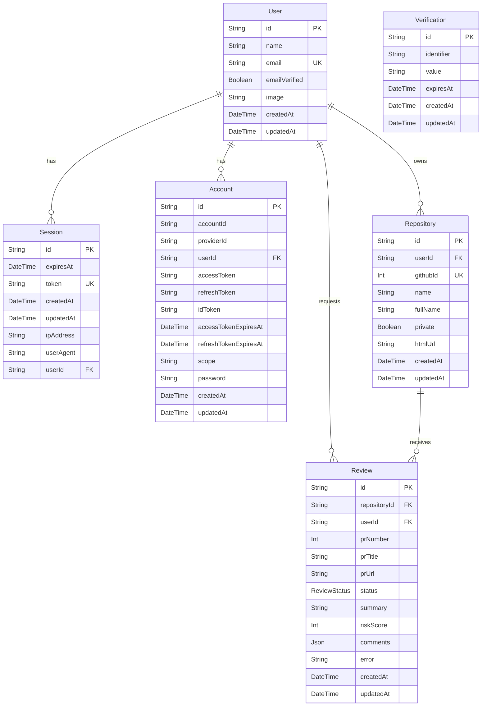

# 🤖 CodeReviewAI

> **Ship better code, faster.** Automated AI-powered code reviews that catch bugs, security issues, and maintainability problems before they reach production.


---

## 🏷️ Badges

[](https://nextjs.org/)
[](https://www.typescriptlang.org/)
[](https://www.npmjs.com/)
[](https://pnpm.io/)
[](https://www.prisma.io/)
[](https://tailwindcss.com/)
[](https://ui.shadcn.com/)
[](https://docs.github.com/en/apps/oauth-apps)
[](https://docs.github.com/en/webhooks)
[](https://better-auth.com/)
[](https://www.inngest.com/)
[](https://x.ai/)

---

## ✨ Features

- 🔍 **Instant Feedback** — Comprehensive code reviews in seconds, not hours
- 🔒 **Security Scanning** — Automatically detect vulnerabilities and exposed secrets
- 💡 **Clear Suggestions** — Actionable feedback you can apply immediately
- 🔗 **PR Integration** — Reviews appear directly inside your pull requests
- 🧠 **Context Aware** — Understands your codebase patterns and style
- 🚀 **Always Improving** — Powered by the latest Grok AI models

---

## 🛠️ Tech Stack

| Layer              | Technology                  |
| ------------------ | --------------------------- |
| Framework          | Next.js 16 (App Router)     |
| Language           | TypeScript                  |
| Styling            | Tailwind CSS v4 + shadcn/ui |
| Database ORM       | Prisma (PostgreSQL)         |
| Authentication     | Better Auth + GitHub OAuth  |
| Background Jobs    | Inngest                     |
| AI Model           | Grok SDK (xAI)              |
| GitHub Integration | GitHub Webhooks             |
| Package Manager    | pnpm                        |

---

## 🚀 Getting Started

### Prerequisites

- Node.js 20+
- pnpm
- PostgreSQL database
- GitHub OAuth App
- Grok API key (xAI)

### Installation

```bash
# Clone the repository
git clone https://github.com/your-username/ai-code-reviewer.git
cd ai-code-reviewer

# Install dependencies
pnpm install

# Copy environment variables
cp .env.example .env
```

### Environment Variables

```env
DATABASE_URL="postgresql://..."

# GitHub OAuth
GITHUB_CLIENT_ID=
GITHUB_CLIENT_SECRET=

# Better Auth
BETTER_AUTH_SECRET=
BETTER_AUTH_URL=http://localhost:3000

# Grok / xAI
GROK_API_KEY=

# Inngest
INNGEST_EVENT_KEY=
INNGEST_SIGNING_KEY=

# GitHub Webhooks
GITHUB_WEBHOOK_SECRET=
```

### Setup & Run

```bash
# Push database schema
pnpm prisma db push

# Generate Prisma client
pnpm prisma generate

# Start development server
pnpm dev
```

Open [http://localhost:3000](http://localhost:3000) in your browser.

---

## 🗄️ Database Schema (ERD)



---

## 📁 Project Structure

```
├── app/
│   ├── (auth)/
│   │   ├── sign-in/
│   │   └── sign-up/
│   ├── (dashboard)/
│   │   ├── dashboard/
│   │   └── repositories/
│   ├── api/
│   │   ├── auth/
│   │   ├── inngest/
│   │   └── webhooks/github/
│   └── page.tsx
├── components/
│   └── ui/
├── lib/
│   ├── auth.ts
│   ├── db.ts
│   ├── inngest/
│   └── grok.ts
├── prisma/
│   └── schema.prisma
└── public/
```

---

## 🔄 How It Works

```
GitHub PR Opened
      │
      ▼
GitHub Webhook ──► /api/webhooks/github
      │
      ▼
Inngest Event Triggered
      │
      ▼
Background Job: Fetch PR Diff
      │
      ▼
Grok AI Analysis
      │
      ▼
Post Review Comments to GitHub PR
      │
      ▼
Save Review to Database (Prisma + PostgreSQL)
```

---

## 📄 License

MIT © 2026 CodeReviewAI
